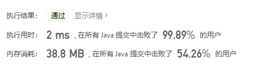
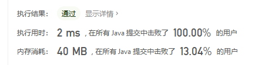

## 002 两数相加

https://leetcode-cn.com/problems/add-two-numbers/
https://github.com/shiinerise/LeetcodeTencent/blob/main/Leetcode%20TenCent/src/leetcode/editor/cn/AddTwoNumbers.java

## 004 寻找两个正序数组的中位数

https://leetcode-cn.com/problems/median-of-two-sorted-arrays/

### 解法一：归并排序

使用归并的方式，合并两个有序数组，得到一个大的有序数组。大的有序数组的中间位置的元素，即为中位数。

### 解法二：二分+递归

https://github.com/shiinerise/LeetcodeTencent/blob/main/Leetcode%20TenCent/src/leetcode/editor/cn/MedianOfTwoSortedArrays.java

